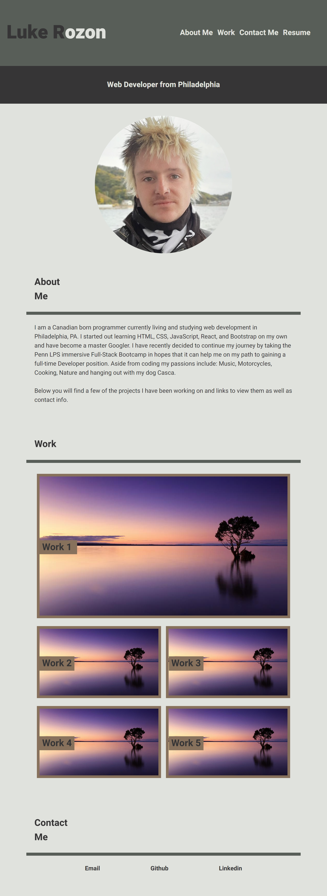

# <luke-portfolio>

## Description 

This is a fully responsive portfolio page for future work projects to be showcased to employers and anyone wanting to view my work. This is a static page made with HTML and CSS. 

The motivation to build this project is to learn the skills to build webpages and style them.

i learned a lot about CSS styling and that I probably have a long way to go before this becomes second nature. 

## Installation

All that is needed is to git pull this to your local server, open with a text editor and view it in default browser

## Usage 

https://zym0tic.github.io/luke-portfolio/

## License

MIT License

Copyright (c) [2022] [Luke Rozon]

Permission is hereby granted, free of charge, to any person obtaining a copy
of this software and associated documentation files (the "Software"), to deal
in the Software without restriction, including without limitation the rights
to use, copy, modify, merge, publish, distribute, sublicense, and/or sell
copies of the Software, and to permit persons to whom the Software is
furnished to do so, subject to the following conditions:

The above copyright notice and this permission notice shall be included in all
copies or substantial portions of the Software.

THE SOFTWARE IS PROVIDED "AS IS", WITHOUT WARRANTY OF ANY KIND, EXPRESS OR
IMPLIED, INCLUDING BUT NOT LIMITED TO THE WARRANTIES OF MERCHANTABILITY,
FITNESS FOR A PARTICULAR PURPOSE AND NONINFRINGEMENT. IN NO EVENT SHALL THE
AUTHORS OR COPYRIGHT HOLDERS BE LIABLE FOR ANY CLAIM, DAMAGES OR OTHER
LIABILITY, WHETHER IN AN ACTION OF CONTRACT, TORT OR OTHERWISE, ARISING FROM,
OUT OF OR IN CONNECTION WITH THE SOFTWARE OR THE USE OR OTHER DEALINGS IN THE
SOFTWARE.